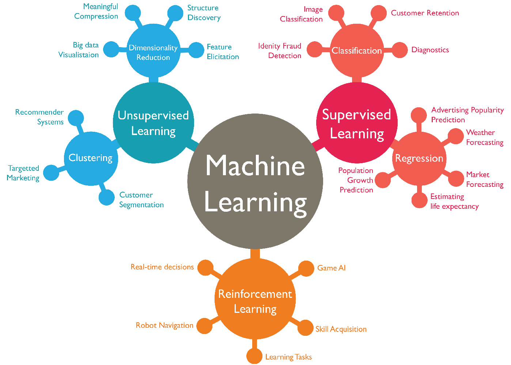

# What is Machine Learning



## 一、 Definition

定义：

1997年，`Tom Mitchell` 给出机器学习的定义：
```
程序利用经验E改善了在任务T中的性能P，就可以说：关于任务T和测量性能P，该程序对经验E进行了学习。
```

## 二、 Classify

分类：
+ 有监督学习`supervised learning` :已知的Data Set中明确了输入/输出，且输入和输出存在关系。 
	+ `Supervised Learning`可以分为：分类(Classification)和回归(Regression)问题。
	+ 1. Classification： 预测离散的结果。将输入映射到离散的类别中。
	+ 2. Regression： 预测连续输出中的结果。 从输入映射到某个连续的函数的输出中。

> 无监督学习使我们能够很少或根本不知道我们的结果应该是什么样子。**我们可以从数据中得出结构**，我们不一定知道变量的影响。 我们可以通过基于数据中变量之间的关系对数据进行聚类来推导出这种结构。 在无监督学习的情况下，**没有基于预测结果的反馈**。无监督学习可以分为“聚类”和“非聚类”。

+ 无监督学习`unsupervised learning` : 没有预知的label，从变量的结构中寻找关系，而没有基于预测结果的反馈。
	+ `Unspervised Learning`可以分为`聚类`， 和 `非聚类`。
	+ 1. 聚类： 可以理解为对数据自动分组成不同变量的相似或者相关的簇。
	+ 2. 非聚类： 比如“鸡尾酒会算法”-->从混乱的环境中识别和查找结果。

> 参考： GitHub Repo：[Halfrost-Field](https://github.com/halfrost/Halfrost-Field)

