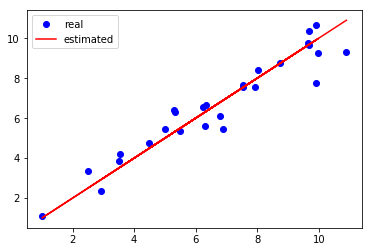

# Linear Regression With One Variable(Gradient Descent)

## 一. Model Representation

在给定训练集的情况下，学习函数h：X→Y，使得h（x）是y的相应值的“好”预测器。由于历史原因，这个函数h被称为假设。


通过输入住房面积 x，通过学习好的函数，输出房子的估价。


## 二. Cost Function

代价函数是线性回归中的一个应用，在线性回归中，要解决的一个问题就是最小化问题。

假设在一元线性回归中，在一个训练集中，我们需要找到一条直线能和该训练集中的点最接近。假设直线方程为 

$$h_{\theta}(x) = \theta_{0} + \theta_{1}x$$


如何选择 $\theta_{0}$、$\theta_{1}$，使得 $h_{\theta}(x)$ 更接近于训练集 (x,y) ？

上述问题可以转换为求 $$ \rm{CostFunction} = \rm{F}({\theta_{0}},{\theta_{1}}) = \frac{1}{2m}\sum_{i = 1}^{m} (h_{\theta}(x^{(i)})-y^{(i)})^2 $$  求最小值$$\min_{{\theta_{0}} {\theta_{1}}} \rm{F}({\theta_{0},{\theta_{1}})} $$


## 三. Gradient Descent 梯度下降


梯度下降的主要思想：

1. 初始化
   $$
   {\theta_{0}}和 {\theta_{1}} , {\theta_{0}} = 0 , {\theta_{1}}=0
   $$

2. 不断的改变 ${\theta_{0}}$ 和 ${\theta_{1}}$ 值，不断减少 $F({\theta_{0}},{\theta_{1}})$ 直至达到最小值（或者局部最小）。


想象成下山，如何下山的速度最快？这里涉及到了下山的速度，即步长。


有趣的是换旁边一个点，下山，找到的最优解可能就是另一个了。这也是梯度下降的一个特点。它会找到所有的局部最优解出来。

梯度下降算法，不断更新：


\begin{align*}
\rm{temp}0 &:= {\theta_{0}} - \alpha * \frac{\partial }{\partial {\theta_{0}}}\rm{F}({\theta_{0}},{\theta_{1}}) \\
\rm{temp}1 &:= {\theta_{1}} - \alpha * \frac{\partial }{\partial {\theta_{1}}}\rm{F}({\theta_{0}},{\theta_{1}}) \\
{\theta_{0}} &:= \rm{temp}0 \\
{\theta_{1}} &:= \rm{temp}1 \\
\end{align*}


直到收敛。注意 ${\theta_{0}}$ 和 ${\theta_{1}}$ 值要**同时更新**，**切记不要求一次导更新一次！**


$\alpha$ 被称作为学习速率。


如果 $\alpha$ 被设置的很小，需要很多次循环才能到底最低点。
如果 $\alpha$ 被设置的很大，来来回回可能就会离最低点越来越远，**会导致无法收敛，甚至发散**。

当快要到最低点的时候，梯度下降会越来越慢，因为 $ \frac{\partial }{\partial {\theta}}$ 越来越小。


## 关于 梯度 和 偏导数 的关系

在上面梯度下降算法中，我们一直用的是偏导数进行讨论的，可能会有人有疑问，偏导数和梯度有啥关系？

### 1. 导数

如果是一元的，那么偏导数就降级成了求导数

$$ f^{'}(x_{0}) = \lim_{\Delta x\rightarrow 0} \frac{\Delta y}{\Delta x} = \lim_{\Delta x\rightarrow 0} \frac{f(x_{0} + \Delta x) - f(x_{0})}{\Delta x} $$

导数的几何意义是切线在该点的斜率，物理意义是函数在这一点的 (瞬时) 变化率。

### 2. 偏导数

在来看看偏导数的定义：


$$
\begin{align*}
f_{x}(x_{0},y_{0}) & = \lim_{\Delta x \rightarrow 0} \frac{f(x_{0} + \Delta x , y_{0}) - f(x_{0},y_{0})}{\Delta x} \\ f_{y}(x_{0},y_{0}) & = \lim_{\Delta y \rightarrow 0} \frac{f(x_{0} , y_{0} + \Delta y) - f(x_{0},y_{0})}{\Delta y} \\
\end{align*}
$$



偏导数的几何意义也是切线的斜率，不过由于在曲面上，在一个点上与该曲面曲线相切的是一个面，就意味着切线有无数条。这里我们感兴趣的是2条切线，一个条是垂直于 y 轴（平行于 xOz 平面）的切线，另外一条是垂直于 x 轴（平行于 yOz 平面）的切线。这两条切线对应的斜率就是对 X 求偏导和对 Y 求偏导。

一个多变量函数的偏导数是它关于其中一个变量的导数，而保持其他变量恒定（相对于全导数，在其中所有变量都允许变化）。

偏导数的物理意义表示函数沿着坐标轴正方向上的变化率。


### 3. 方向导数


在说梯度之前，不应该漏掉方向导数。偏导数是求的在特定的2个方向上的导数，但是任意一个方向上也是存在导数的。这里就引入了方向导数的概念。

>设函数 u = u(x,y) 在点 $p_{0}(x_{0},y_{0})$ 的某空间临域 $ U \subset R^{2}$ 内有定义， L 为从点 $p_{0}$ 出发的射线，$p(x_{0},y_{0})$ 为 L 上且在 U 内的任一点，以 $t = \sqrt{(\Delta x)^{2} +(\Delta y)^{2} }$ 表示 $p$ 与 $p_{0}$ 之间的距离，若极限 ：

>$$ \left.\begin{matrix}
\frac{\partial f}{\partial l}
\end{matrix}\right|_{(x_{0},y_{0})} = \lim_{t \rightarrow 0^{+}} \frac{f(x_{0} + tcos \alpha , y_{0}  +   tcos \beta) - f(x_{0},y_{0})}{t}
$$
>存在，则称此极限为函数 u = u(x,y) 在点 $p_{0}$ 沿方向 L 的方向导数，记作 $ \left.\begin{matrix}
\frac{\partial f}{\partial l}
\end{matrix}\right|_{(x_{0},y_{0})}$ 。

方向导数是偏导数的概念的推广, 偏导数研究的是指定方向 (坐标轴方向) 的变化率，到了方向导数，指定的方向可以是任意方向了。

>如果函数 u = u(x,y) 在点 $p_{0}(x_{0},y_{0})$ 可微分，那么函数在该点沿任一方向 L 的方向导数存在，且有

>$$ \left.\begin{matrix}
\frac{\partial f}{\partial l}
\end{matrix}\right|_{(x_{0},y_{0})} = f_{x}(x_{0},y_{0})cos \alpha + f_{y}(x_{0},y_{0})cos \beta
$$

>其中， $cos \alpha  $ ，$cos \beta$ 是方向 L 的方向余弦。

一个标量场在某点沿着某个向量方向上的方向导数，描绘了该点附近标量场沿着该向量方向变动时的瞬时变化率。这个向量方向可以是任一方向。

方向导数的物理意义表示函数在某点沿着某一特定方向上的变化率。

### 4. 梯度

最后来讲讲梯度，梯度的定义：

>在二元函数的情形，设函数 $f(x,y)$ 在平面区域 D 内具有一阶连续偏导数，则对于每一点 $P_{0}(x_{0},y_{0}) \in D $,都可定出一个向量：

>$$ f_{x}(x_{0},y_{0}) \vec{i} + f_{y}(x_{0},y_{0}) \vec{j} $$

>这个向量称为函数 $f(x,y)$ 在点 $p_{0}(x_{0},y_{0})$ 的梯度，记作 $ \textbf{grad}\;\;f(x_{0},y_{0}) $ 或 $ \triangledown f(x_{0},y_{0}) $ , 即

>$$ \textbf{grad}\;\;f(x_{0},y_{0}) = \triangledown f(x_{0},y_{0}) = f_{x}(x_{0},y_{0}) \vec{i} + f_{y}(x_{0},y_{0}) \vec{j} $$


>其中 $ \triangledown = \frac{\partial }{\partial x} \vec{i} + \frac{\partial }{\partial y} \vec{j} $ 称为 (二维的) 向量微分算子 或者 Nabla 算子， $ \triangledown f = \frac{\partial f}{\partial x} \;\; \vec{i} + \frac{\partial f }{\partial y} \;\; \vec{j} $


如果函数 $f(x,y)$ 在点 $p_{0}(x_{0},y_{0})$ 可微分， $\vec{e_{j}} = (cos \alpha,cos \beta)$ 是与方向 L 同向的单位向量，则：


$$
\begin{align*}
\left.\begin{matrix}
\frac{\partial f}{\partial l}
\end{matrix}\right|_{(x_{0},y_{0})} &= f_{x}(x_{0},y_{0})cos \alpha + f_{y}(x_{0},y_{0})cos \beta \\
&= \textbf{grad}\;\;f(x_{0},y_{0}) \cdot \vec{e_{j}} = \left | \textbf{grad}\;\;f(x_{0},y_{0}) \right | cos \theta \\
\end{align*}
$$



其中 $ \theta $ 为 $ \textbf{grad}\;\;f(x_{0},y_{0}) $ 与 $ \vec{e_{j}} $ 的夹角。


1. 当 $\theta = 0 $ 的时候，$\left.\begin{matrix}
\frac{\partial f}{\partial l}
\end{matrix}\right|_{(x_{0},y_{0})}  = \left | \textbf{grad}\;\;f(x_{0},y_{0}) \right |$

即 **函数 $f(x,y)$ 在一点的梯度 $ \textbf{grad}\;\;f $ 是这样的一个向量，它的方向是函数在这点的方向导数取得最大值的方向，它的模就等于方向导数的最大值** 。

2. 当 $\theta = \pi $ 的时候，$\left.\begin{matrix}
\frac{\partial f}{\partial l}
\end{matrix}\right|_{(x_{0},y_{0})}  = - \left | \textbf{grad}\;\;f(x_{0},y_{0}) \right |$

即 $ \vec{e_{j}} $ 与 梯度 方向相反的时候，函数减少最快，在这个方向的方向导数达到最小值。


**所以梯度下降就是基于这个原理**。

函数在某一点处的方向导数在其梯度方向上达到最大值，此最大值即梯度的模数。

这就是说，沿梯度方向，函数值增加最快。同样可知，方向导数的最小值在梯度的相反方向取得，此最小值为最大值的相反数，从而沿梯度相反方向函数值的减少最快。

| 概念                                            | 物理意义                                 |
| ----------------------------------------------- | ---------------------------------------- |
| 导数   $ f^{'}(x)  $                            | 函数在该点的瞬时变化率                   |
| 偏导数 $ \frac{\partial f(x,y) }{\partial x}  $ | 函数在坐标轴方向上的变化率               |
| 方向导数                                        | 函数在某点沿某个特定方向的变化率         |
| 梯度  $ \textbf{grad}\;\;f(x,y)  $              | 函数在该点沿所有方向变化率最大的那个方向 |


## 四. Linear Regression 线性回归

梯度下降是很常用的算法，它不仅被用在线性回归，还用在线性回归模型、平方误差代价函数中。

\begin{align*}
\frac{\partial }{\partial {\theta_{j}}}\rm{F}({\theta_{0}},{\theta_{1}}) & = \frac{\partial }{\partial {\theta_{j}}} \frac{1}{2m}\sum_{i = 1}^{m} (h_{\theta}(x^{(i)})-y^{(i)})^2\\
\end{align*}


令 $ z = (h_{\theta}(x^{(i)})-y^{(i)})^2$ , $ u = h_{\theta}(x^{(i)})-y^{(i)}$ , 则 $ z = u^2 $。 考虑到 $f(z)$  和 $f(u)$ 都是连续的，则有：


\begin{align*}
\frac{\partial }{\partial {\theta_{j}}}\rm{F}({\theta_{0}},{\theta_{1}}) & = \frac{\partial }{\partial {\theta_{j}}} \frac{1}{2m}\sum_{i = 1}^{m} (h_{\theta}(x^{(i)})-y^{(i)})^2\\
& = \frac{1}{2m}\sum_{i = 1}^{m} \frac{\partial z }{\partial u} \frac{\partial u }{\partial {\theta_{j}}} = \frac{1}{2m} * 2 \sum_{i = 1}^{m} u \frac{\partial u }{\partial {\theta_{j}}}\\
& = \frac{1}{m} \sum_{i = 1}^{m} u \frac{\partial u }{\partial {\theta_{j}}} \\
\end{align*}



++++++++++++

将 u 展开 $ u = \theta_{0} + {\theta_{1}}x^{(i)}-y^{(i)}$ , 令 j = 0,则有


\begin{align*}
\frac{\partial }{\partial {\theta_{0}}}\rm{F}({\theta_{0}},{\theta_{1}}) &= \frac{1}{m} \sum_{i = 1}^{m} u \frac{\partial u }{\partial {\theta_{0}}} \\
&= \frac{1}{m} \sum_{i = 1}^{m}(\theta_{0} + \theta_{1}x^{(i)} - y^{(i)}) = \frac{1}{m} \sum_{i = 1}^{m}(h_{\theta}(x^{(i)}) - y^{(i)}) \\
\end{align*}


令 j = 1,则有


\begin{align*}
\frac{\partial }{\partial {\theta_{1}}}\rm{F}({\theta_{0}},{\theta_{1}}) &=  \frac{1}{m} \sum_{i = 1}^{m} u \frac{\partial u }{\partial {\theta_{1}}}\\
&= \frac{1}{m} \sum_{i = 1}^{m}(\theta_{0} + \theta_{1}x^{(i)} - y^{(i)}) * x^{(i)} = \frac{1}{m} \sum_{i = 1}^{m}(h_{\theta}(x^{(i)}) - y^{(i)}) * x^{(i)} \\
\end{align*}



梯度下降算法：

 
\begin{align*}
\rm{temp}0 &:= {\theta_{0}} - \alpha * \frac{\partial }{\partial {\theta_{0}}}\rm{F}({\theta_{0}},{\theta_{1}}) = {\theta_{0}} - \alpha * \frac{1}{m} \sum_{i = 1}^{m}(h_{\theta}(x^{(i)}) - y^{(i)})  \\
\rm{temp}1 &:= {\theta_{1}} - \alpha * \frac{\partial }{\partial {\theta_{1}}}\rm{F}({\theta_{0}},{\theta_{1}}) = {\theta_{1}} - \alpha * \frac{1}{m} \sum_{i = 1}^{m}(h_{\theta}(x^{(i)}) - y^{(i)}) * x^{(i)} \\
{\theta_{0}} &:= \rm{temp}0  \\
{\theta_{1}} &:= \rm{temp}1  \\
\end{align*}



当然除了用梯度下降的迭代算法，还有其他方法可以算出代价函数的最小值，比如线性代数里面的 正规方程组法。但是两者相比较而言，梯度下降适合更大的数据集。


举个例子，通过梯度下降不断更新以后，线性回归以后的曲线和原始数据集会越来越拟合。


```python
import numpy as np
x_train = np.array([[2.5], [3.5], [6.3], [9.9], [9.91], [8.02],
                    [4.5], [5.5], [6.23], [7.923], [2.941], [5.02],
                    [6.34], [7.543], [7.546], [8.744], [9.674], [9.643],
                    [5.33], [5.31], [6.78], [1.01], [9.68],
                    [9.99], [3.54], [6.89], [10.9]], dtype=np.float32)

y_train = np.array([[3.34], [3.86], [5.63], [7.78], [10.6453], [8.43],
                    [4.75], [5.345], [6.546], [7.5754], [2.35654], [5.43646],
                    [6.6443], [7.64534], [7.546], [8.7457], [9.6464], [9.74643],
                    [6.32], [6.42], [6.1243], [1.088], [10.342],
                    [9.24], [4.22], [5.44], [9.33]], dtype=np.float32)

y_data = np.array([[2.5], [3.5], [6.3], [9.9], [9.91], [8.02],
                    [4.5], [5.5], [6.23], [7.923], [2.941], [5.02],
                    [6.34], [7.543], [7.546], [8.744], [9.674], [9.643],
                    [5.33], [5.31], [6.78], [1.01], [9.68],
                    [9.99], [3.54], [6.89], [10.9]], dtype=np.float32)
```


```python
import matplotlib.pyplot as plt
%matplotlib inline
plt.plot(x_train, y_train, 'bo',label='real')
plt.plot(x_train, y_data, 'r-',label='estimated')
plt.legend()
```


    <matplotlib.legend.Legend at 0x7fa6805ab128>





------------------------------------------------------

> GitHub Repo：[Halfrost-Field](https://github.com/halfrost/Halfrost-Field)
> 
> Follow: [halfrost · GitHub](https://github.com/halfrost)
>
> Source: [https://github.com/halfrost/Halfrost-Field/blob/master/contents/Machine\_Learning/Gradient\_descent.ipynb](https://github.com/halfrost/Halfrost-Field/blob/master/contents/Machine_Learning/Gradient_descent.ipynb)
